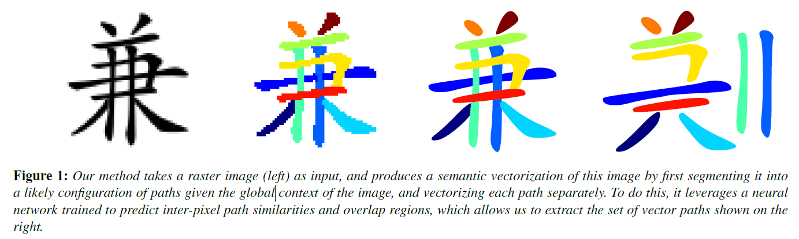
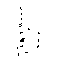

# Semantic Segmentation for Line Drawing Vectorization Using Neural Networks

Tensorflow implementation of [Semantic Segmentation for Line Drawing Vectorization Using Neural Networks](http://www.byungsoo.me/project/vectornet).

[Byungsoo Kim¹](http://www.byungsoo.me), [Oliver Wang²](http://www.oliverwang.info), [Cengiz Öztireli¹](https://graphics.ethz.ch/~cengizo), [Markus Gross¹](https://graphics.ethz.ch/people/grossm)

¹ETH Zurich, ²Adobe Research

Computer Graphics Forum (Proceedings of Eurographics 2018)

## Requirements

This code is tested on Windows 10 and Ubuntu 16.04 with the following requirements:

- [anaconda3 / python3.6](https://www.anaconda.com/download/#linux)
- [TensorFlow 1.4](https://github.com/tensorflow/tensorflow)
- [CairoSVG 2.1.2](http://cairosvg.org/)
- [Matplotlib 2.1.0](https://matplotlib.org/)
- [imageio 2.2.0](https://pypi.python.org/pypi/imageio)
- [tqdm](https://github.com/tqdm/tqdm)
- [Potrace](http://potrace.sourceforge.net/)

After installing anaconda, run `pip install tensorflow-gpu cairosvg matplotlib imageio tqdm`. In case of Potrace, unzip it `(i.e. potrace/potrace.exe)` on Windows or run `sudo apt-get install potrace` on Ubuntu.

## Usage

Download a preprocessed dataset first and unzip it `(i.e. data/ch/train)`.

- [Chinese](http://gofile.me/6tGZC/zbws8gqEK) [(source)](https://github.com/skishore/makemeahanzi)
- [Kanji](http://gofile.me/6tGZC/R7FWjODa2) [(source)](https://github.com/KanjiVG/kanjivg/releases)
- [Quick Draw](http://gofile.me/6tGZC/VIH81NZJH) [(source)](https://github.com/googlecreativelab/quickdraw-dataset)
- [Random Lines](http://gofile.me/6tGZC/GEoKSdiDc)

To train PathNet on Chinese characters:
    
    $ python main.py --is_train=True --archi=path --dataset=ch

To train OverlapNet on Chinese characters:
    
    $ python main.py --is_train=True --archi=overlap --dataset=ch

To vectorize Chinese characters:

    $ .\build_win.bat or ./build_linux.sh
    $ python main.py --is_train=False --dataset=ch --load_pathnet=log/path/MODEL_DIR--load_overlapnet=log/overlap/MODEL_DIR

## Results

### PathNet output (64x64) after 50k steps (From top to bottom: input / output / ground truth)

### OverlapNet output (64x64) after 50k steps (From top to bottom: input / output / ground truth)

### Vectorization output (64x64)

From left to right: input / raster / transparent / overlap / vector

## Reference

- Multi-label Optimization: [gco](http://vision.csd.uwo.ca/code/gco-v3.0.zip), [qpbo](http://pub.ist.ac.at/~vnk/software/QPBO-v1.3.src.tar.gz)
- Tensorflow Framework: [carpedm20](https://github.com/carpedm20/BEGAN-tensorflow)

<!-- 
## Useful Settings

anaconda: (Windows) [ImportError: No module named 'pip._vendor.requests.adapters' for any pip command](https://github.com/ContinuumIO/anaconda-issues/issues/6719)

    conda install pip -f

anaconda: (Windows) [dlopen() failed to load a library: cairo / cairo-2](https://github.com/Kozea/CairoSVG/issues/84)

    Install [GTK+](https://github.com/tschoonj/GTK-for-Windows-Runtime-Environment-Installer/releases/download/2017-11-15/gtk3-runtime-3.22.26-2017-11-15-ts-win64.exe)

git: replace existing folder

    git clone https://myrepo.com/git.git temp
    mv temp/.git code/.git
    rm -rf temp

git: line ending

    git config --global core.autocrlf true # for windows (checkout crlf, commit unix)
    git config --global core.autocrlf input # for linux (checkout as-is, commit unix)

git: save credentials

    git config --global credential.helper 'store --file ~/.git-credentials'

visual studio code: old tasks.json

    "version": "0.1.0",
	"command": "python",
	"isShellCommand": true,
	"args": ["${file}"],
	"showOutput": "always"

visual studio code: default setup of keybindings.json

    { "key": "f7",               "command": "workbench.action.tasks.runTask" },
    { "key": "shift+f7",         "command": "workbench.action.tasks.terminate" },
    { "key": "f6",               "command": "python.execInTerminal" }

visual studio code: specify python version in user/workspace settings

    "python.pythonPath": "~/Anaconda3/envs/py27/python"

visual studio code: stop at the beginning of debugging

    "stopOnEntry": false, (launch.json)
 -->

<!-- 
## Usage

First download [CelebA](http://mmlab.ie.cuhk.edu.hk/projects/CelebA.html) datasets with:

    $ apt-get install p7zip-full # ubuntu
    $ brew install p7zip # Mac
    $ python download.py

or you can use your own dataset by placing images like:

    data
    └── YOUR_DATASET_NAME
        ├── xxx.jpg (name doesn't matter)
        ├── yyy.jpg
        └── ...

To train a model:

    $ python main.py --dataset=CelebA --use_gpu=True
    $ python main.py --dataset=YOUR_DATASET_NAME --use_gpu=True

To test a model (use your `load_path`):

    $ python main.py --dataset=CelebA --load_path=CelebA_0405_124806 --use_gpu=True --is_train=False --split valid

## Results

### Generator output (64x64) with `gamma=0.5` after 300k steps

### Generator output (128x128) with `gamma=0.5` after 200k steps

### Interpolation of Generator output (64x64) with `gamma=0.5` after 300k steps

### Interpolation of Generator output (128x128) with `gamma=0.5` after 200k steps

    
### Interpolation of Discriminator output of real images
    
   
   
   
   
   
   
   
   
   
   

## Related works

- [DCGAN-tensorflow](https://github.com/carpedm20/DCGAN-tensorflow)
- [DiscoGAN-pytorch](https://github.com/carpedm20/DiscoGAN-pytorch)
- [simulated-unsupervised-tensorflow](https://github.com/carpedm20/simulated-unsupervised-tensorflow)

## Author

Taehoon Kim / [@carpedm20](http://carpedm20.github.io) -->
